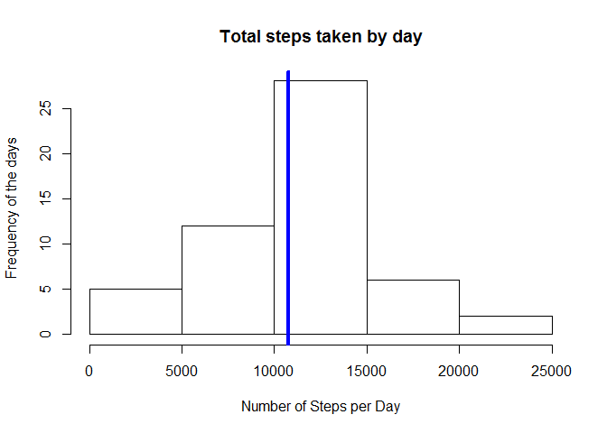
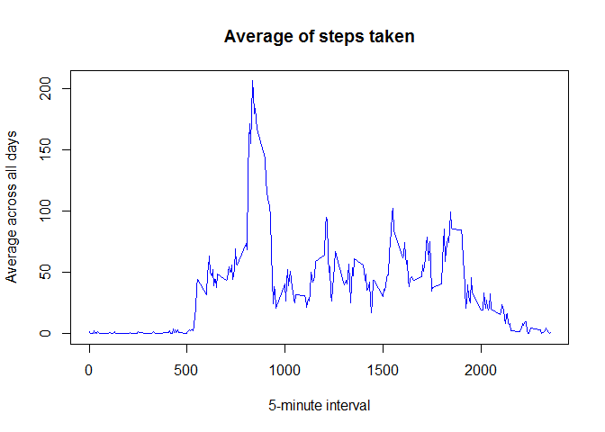
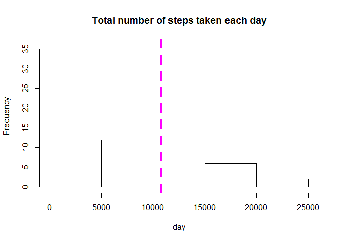
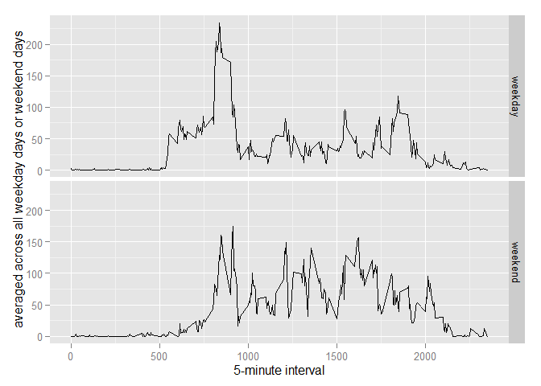

# Reproducible Research: Peer Assessment 1
## Clear the workspace and set the working directory

```r
rm(list=ls())
```

## Loading and preprocessing the data


```r
library(lattice)
```

```
## Warning: package 'lattice' was built under R version 3.2.2
```

```r
library(ggplot2)
```

```
## Warning: package 'ggplot2' was built under R version 3.2.2
```

```r
ActivityData <- read.csv("activity.csv", colClasses = c("numeric", "character", "numeric"))
head(ActivityData)
```

```
##   steps       date interval
## 1    NA 2012-10-01        0
## 2    NA 2012-10-01        5
## 3    NA 2012-10-01       10
## 4    NA 2012-10-01       15
## 5    NA 2012-10-01       20
## 6    NA 2012-10-01       25
```

```r
#Convert the date variable to Date class.
ActivityData$date <- as.Date(ActivityData$date, "%Y-%m-%d")
```

## What is mean total number of steps taken per day?

##1. Calculate the total number of steps taken per day

```r
StepsByDay <- aggregate(steps ~ date, data = ActivityData, sum, na.rm = TRUE)
head(StepsByDay)
```

```
##         date steps
## 1 2012-10-02   126
## 2 2012-10-03 11352
## 3 2012-10-04 12116
## 4 2012-10-05 13294
## 5 2012-10-06 15420
## 6 2012-10-07 11015
```

```r
#        date steps
#1 2012-10-02   126
#2 2012-10-03 11352
#3 2012-10-04 12116
#4 2012-10-05 13294
#5 2012-10-06 15420
#6 2012-10-07 11015
```

##2. Make a histogram of the total number of steps taken each day

```r
hist(StepsByDay$steps, main = "Total steps taken by day", xlab = "Number of Steps per Day", 
                                                          ylab = "Frequency of the days")
abline(v=mean(StepsByDay$steps),col="blue",lwd=4)
```

 


##3. Calculate and report the mean and median of the total number of steps taken per day

```r
mean(StepsByDay$steps)
```

```
## [1] 10766.19
```

```r
median(StepsByDay$steps)
```

```
## [1] 10765
```

```r
#The mean and median are: ## [1] 10766 and 10765
```

## What is the average daily activity pattern?

##1. Make a time series plot (i.e. type = "l") of the 5-minute interval (x-axis) and the average number of steps taken, averaged across all days (y-axis)

```r
TimeSeries <- tapply(ActivityData$steps, ActivityData$interval, mean, na.rm = TRUE)
head(TimeSeries,6)
```

```
##         0         5        10        15        20        25 
## 1.7169811 0.3396226 0.1320755 0.1509434 0.0754717 2.0943396
```

```r
#The plot is:
  
plot(row.names(TimeSeries), TimeSeries, type = "l", xlab = "5-minute interval", 
             ylab = "Average across all days", main = "Average of steps taken",col="blue")
```

 

##2. Which 5-minute interval, on average across all the days in the dataset, contains the maximum number of steps?

```r
MaxSteps <- which.max(TimeSeries)
names(MaxSteps)
```

```
## [1] "835"
```

```r
#[1] "835"
```

## Imputing missing values

##1. Calculate and report the total number of missing values in the dataset (i.e. the total number of rows with NAs)

```r
NA_Values <- sum(is.na(ActivityData))
NA_Values
```

```
## [1] 2304
```

```r
#[1] 2304 
```

##2. Devise a strategy for filling in all of the missing values in the dataset. The strategy does not need to be sophisticated. For example, you could use the mean/median for that day, or the mean for that 5-minute interval, etc.

```r
#First NA replaced by median in 5 min interval
 StepsMean <- aggregate(steps ~ interval, data = ActivityData, FUN = mean)
  NAFilling <- numeric()
  for (i in 1:nrow(ActivityData)) {
    Use <- ActivityData[i, ]
    if (is.na(Use$steps)) {
      steps <- subset(StepsMean, interval == Use$interval)$steps
    } else {
      steps <- Use$steps
    }
    NAFilling <- c(NAFilling, steps)
  }
```

##3. Create a new dataset that is equal to the original dataset but with the missing data filled in.

```r
NewActivityData <- ActivityData
NewActivityData$steps <- NAFilling
```

##4. Make a histogram of the total number of steps taken each day and Calculate and report the mean and median total number of steps taken per day. Do these values differ from the estimates from the first part of the assignment? What is the impact of imputing missing data on the estimates of the total daily number of steps?

```r
StepsTotal <- aggregate(steps ~ date, data = NewActivityData, sum, na.rm = TRUE)

hist(StepsTotal$steps, main = "Total number of steps taken each day", xlab = "day")
#The mean and median are
abline(v=mean(StepsTotal$steps),col="magenta",lwd=4,lty=2)
```

 

```r
mean(StepsTotal$steps)
```

```
## [1] 10766.19
```

```r
#[1] 10766.19
median(StepsTotal$steps)
```

```
## [1] 10766.19
```

```r
#[1] 10766.19
```

## Are there differences in activity patterns between weekdays and weekends?

##1. Create a new factor variable in the dataset with two levels - "weekday" and "weekend" indicating whether a given date is a weekday or weekend day.

```r
 ActivityData$daylevel <-  ifelse(as.POSIXlt(ActivityData$date)$wday %in% c(0,6), 'weekend', 'weekday')
  stepsByDayLevel <- aggregate(steps ~ interval + daylevel, data=ActivityData, mean)
```


##2. Make a panel plot containing a time series plot (i.e. type = "l") of the 5-minute interval (x-axis) and the average number of steps taken, averaged across all weekday days or weekend days (y-axis). 


```r
ggplot( stepsByDayLevel, aes(interval, steps)) + 
    geom_line() + 
    facet_grid(daylevel ~ .) +
    xlab("5-minute interval") + 
    ylab("averaged across all weekday days or weekend days")
```

 

